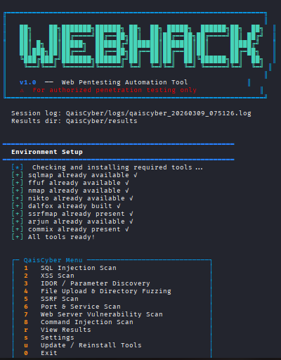

# 🛡️ WebHack Toolkit v2.0

**WebHack** is an advanced, automated web penetration testing framework designed to streamline the reconnaissance and vulnerability assessment phases. It integrates industry-standard tools into a unified, interactive interface for ethical hackers and security researchers.

---

## 🎥 Video Demo
See **WebHack** in action and learn how to use its modules:

[](https://www.youtube.com/watch?v=YOUR_VIDEO_ID)

> *Click the thumbnail above to watch the full tutorial on YouTube.*

---

## 🚀 Features

WebHack automates the execution of several security modules:

* **💉 SQL Injection:** Full automation using `sqlmap` with WAF bypass configurations.
* **💠 XSS Scanning:** Advanced reflected and stored XSS detection via `Dalfox`.
* **🔍 Parameter Discovery:** Hidden parameter mining using `Arjun`.
* **📂 Directory Fuzzing:** Fast web path discovery and file brute-forcing with `ffuf`.
* **🔗 SSRF Mapping:** Probing server-side request forgery with `SSRFmap`.
* **🌐 Network Recon:** Port scanning and service fingerprinting via `Nmap`.
* **🛠️ CMS & Server Auditing:** Comprehensive web server vulnerability scans with `Nikto`.
* **💻 Command Injection:** Testing OS command injection flaws using `Commix`.

---

## 📸 Screenshots

| Main Menu | Vulnerability Scan |
| :---: | :---: |
|  

---

## 🛠️ Installation & Setup

WebHack is designed for **Kali Linux**, **Parrot OS**, or any Debian-based distribution.

### 1. Clone the repository
```bash
git clone https://github.com/qaiscyber/webhack.git
cd webhack

###2. Run the setup
The setup module will automatically handle all dependencies (Apt, Pip, Go, and Git tools).

Bash
sudo python3 webhack.py --setup

###⚙️ Configuration
You can customize the tool's behavior by editing config.json or through the Settings menu:

Wordlists: Change default paths for fuzzing.

Performance: Adjust threads and timeout settings.

Anonymity: Set up HTTP/SOCKS proxies.

###📂 Project Structure
tools/: External security tools binaries and repos.

results/: Organized scan outputs and reports (Auto-saved).

logs/: Detailed session logs for debugging.

###⚠️ Disclaimer
NOTE: This tool is for Legal and Ethical Purposes Only. The author is not responsible for any misuse or damage caused by this tool. Only use it on targets you have explicit, written permission to test.

###🤝 Contributing
Contributions, issues, and feature requests are welcome! Feel free to check the issues page.

Made with ❤️ by Qais
